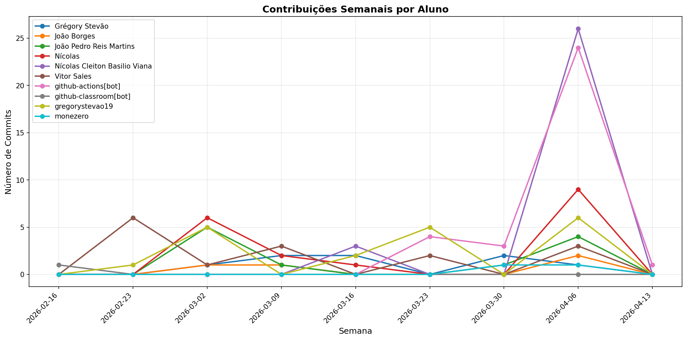

# 📊 Relatório de Contribuições do Projeto

**Última atualização:** 27/04/2026 00:30

---

## 📈 Resumo Geral de Contribuições

| Aluno                         |   Commits |   Linhas+ |   Linhas- |   Arquivos |   Docs Commits |   Docs Arquivos |
|-------------------------------|-----------|-----------|-----------|------------|----------------|-----------------|
| Grégory Stevão                |         8 |        12 |        10 |          5 |              6 |               2 |
| João Borges                   |         4 |        16 |        17 |          2 |              4 |               2 |
| João Pedro Reis Martins       |        11 |      1542 |        34 |         33 |             11 |               5 |
| Nícolas                       |        18 |        63 |        77 |          3 |             11 |               3 |
| Nícolas Cleiton Basilio Viana |        29 |     29641 |       875 |        158 |             14 |               3 |
| Vitor Sales                   |        15 |      1476 |        31 |         33 |             15 |               8 |
| github-actions[bot]           |        32 |       232 |       224 |          3 |             32 |               1 |
| github-classroom[bot]         |         1 |      2152 |         0 |         45 |              1 |              13 |
| gregorystevao19               |        19 |     18854 |       688 |        175 |             11 |               3 |
| monezero                      |         2 |      4559 |       917 |         19 |              0 |               0 |

## 📅 Contribuições Semanais (Todo o Semestre)

**2026-04-13**: github-actions[bot]: 1

**2026-04-06**: Grégory Stevão: 1, João Borges: 2, João Pedro Reis Martins: 4, Nícolas: 9, Nícolas Cleiton Basilio Viana: 26, Vitor Sales: 3, github-actions[bot]: 24, gregorystevao19: 6, monezero: 1

**2026-03-30**: Grégory Stevão: 2, João Pedro Reis Martins: 1, github-actions[bot]: 3, monezero: 1

**2026-03-23**: Vitor Sales: 2, github-actions[bot]: 4, gregorystevao19: 5

**2026-03-16**: Grégory Stevão: 2, Nícolas: 1, Nícolas Cleiton Basilio Viana: 3, gregorystevao19: 2

**2026-03-09**: Grégory Stevão: 2, João Borges: 1, João Pedro Reis Martins: 1, Nícolas: 2, Vitor Sales: 3

**2026-03-02**: Grégory Stevão: 1, João Borges: 1, João Pedro Reis Martins: 5, Nícolas: 6, Vitor Sales: 1, gregorystevao19: 5

**2026-02-23**: Vitor Sales: 6, gregorystevao19: 1

**2026-02-16**: github-classroom[bot]: 1

## 📊 Visualização Gráfica

## ℹ️ Observações

- **Commits**: Número total de commits realizados

- **Linhas+**: Linhas de código adicionadas

- **Linhas-**: Linhas de código removidas

- **Arquivos**: Número de arquivos únicos modificados

- **Docs Commits**: Commits em arquivos de documentação

- **Docs Arquivos**: Arquivos de documentação modificados

---

*Relatório gerado automaticamente via GitHub Actions*
