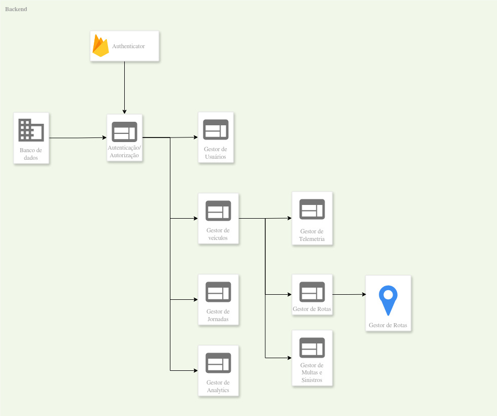

# APIs e Web Services - Gestão de Frota

Este backend expõe serviços para autenticação/autorização, gestão de membros, CRUD de veículos e acompanhamento de jornadas com geolocalização.

## Objetivos da API

- Centralizar operações da aplicação de gestão de frota em uma API REST.
- Garantir controle de acesso por identidade autenticada e perfil de usuário.
- Registrar jornada e posição de deslocamento em tempo real.
- Disponibilizar documentação navegável via Swagger (`/docs` em ambiente não produção).

## Modelagem da Aplicação

Principais entidades de domínio:

- `User`: conta do sistema (email, provider, role, etc.).
- `Vehicle`: cadastro de veículos da frota.
- `Journey`: jornada de deslocamento (status, início, usuário).
- `JourneyStop`: paradas planejadas de uma jornada.
- `JourneyPosition`: posições geográficas registradas durante uma jornada.



## Tecnologias Utilizadas

- `NestJS` (framework principal da API)
- `TypeORM` (persistência e mapeamento objeto-relacional)
- `PostgreSQL` (banco de dados)
- `Firebase Admin` (validação de token de autenticação)
- `Swagger` (OpenAPI para documentação)
- `class-validator` e `class-transformer` (validação e transformação de DTOs)
- `Jest` e `Supertest` (testes)

## API Endpoints

- Base URL local (padrão): `http://localhost:3030`
- Documentação oficial do Swagger: a [documentação do swagger em nuvem](https://icei-puc-minas-pmv-si.github.io/pmv-si-2026-1-pe6-t2-t2-g7-gestao-de-frota/swagger/) serve para fins de referências e validações dos docentes, para interagir com a API diretamente é necessário ativar o servidor localmente e acessar o endpoint ```/docs```
- OpenAPI (JSON): [https://icei-puc-minas-pmv-si.github.io/pmv-si-2026-1-pe6-t2-t2-g7-gestao-de-frota/swagger/swagger.json](https://icei-puc-minas-pmv-si.github.io/pmv-si-2026-1-pe6-t2-t2-g7-gestao-de-frota/swagger/swagger.json)

## Considerações de Segurança

- A API usa `AuthGuard` global para validar Bearer token.
- O token é validado via Firebase e o usuário é resolvido/sincronizado internamente.
- Há controle de permissão por papéis (`owner`, `admin`, `user`) em endpoints sensíveis.
- `ValidationPipe` global está ativo com:
  - `whitelist: true`
  - `forbidNonWhitelisted: true`
  - `forbidUnknownValues: true`

## Implantação

Fluxo recomendado:

1. Configurar variáveis de ambiente (`.env`, `.env.prod`), especialmente banco e Firebase.
2. Instalar dependências no backend.
3. Executar migrations:
   - `pnpm migrate:run`
4. Build e execução:
   - `pnpm build`
   - `pnpm start:prod`
5. Validar saúde dos endpoints e autenticação após deploy.

## Testes

Comandos úteis:

- `pnpm test`: para testes unitários
- `pnpm test:e2e`: para testes E2E

### Casos E2E de autenticação

Os cenários E2E de autenticação usam `@nestjs/testing` para subir uma instância global do `AppModule` em `beforeAll`, com todos os controllers carregados. Firebase, TypeORM e `UserRepo` são substituídos por mocks em memória para evitar dependência de serviços externos.

| Caso                             | Requisição                                       | Resultado esperado                                                                            |
| -------------------------------- | ------------------------------------------------ | --------------------------------------------------------------------------------------------- |
| Requisição sem Bearer token      | `GET /members`                                   | `403 Forbidden`; Firebase não deve ser chamado.                                               |
| Bearer token inválido            | `GET /members`                                   | `403 Forbidden`; validação de token deve ser chamada com `checkRevoked=true`.                 |
| Sincronização de usuário novo    | `POST /account/sync`                             | `201 Created`; cria usuário em memória e retorna `uid`, `email`, `name`, `provider` e `role`. |
| Atualização da conta autenticada | `PATCH /account/:id`                             | `200 OK`; atualiza o nome do usuário autenticado.                                             |
| Remoção da conta autenticada     | `DELETE /account/:id`                            | `204 No Content`; remove usuário no Firebase mockado e no repositório mockado.                |
| Listagem de membros              | `GET /members?limit=2`                           | `200 OK`; retorna lista paginada e total.                                                     |
| Busca de membro                  | `GET /member/:id`                                | `200 OK`; retorna o membro encontrado.                                                        |
| Alteração de cargo sem permissão | `PATCH /member/:id?role=admin` com usuário comum | `403 Forbidden`.                                                                              |
| Alteração de cargo com admin     | `PATCH /member/:id?role=admin` com admin         | `200 OK`; retorna membro com `role=admin`.                                                    |
| Remoção de owner                 | `DELETE /member/:id` para usuário `owner`        | `401 Unauthorized`; operação bloqueada pelo `PreventOwnerGuard`.                              |
| Remoção de membro por admin      | `DELETE /member/:id` com admin                   | `204 No Content`; remove usuário no Firebase mockado e no repositório mockado.                |

### Casos de teste de analytics

Os testes de analytics foram adicionados em duas camadas: unitária para validar o mapeamento dos serviços sobre as views e E2E para validar autenticação, contrato HTTP e formato final exposto pelos endpoints `/analytics`.

| Tipo     | Arquivo                                                                 | Caso                                                                 | Resultado esperado                                                                                  |
| -------- | ----------------------------------------------------------------------- | -------------------------------------------------------------------- | --------------------------------------------------------------------------------------------------- |
| Unitário | `test/unit/modules/analytics/services/GetDashboard.service.spec.ts`     | Conversão dos campos do dashboard                                    | `totalUsers`, `totalVehicles`, `totalJourneys`, `journeysInProgress` e `journeysFinished` como `number`. |
| Unitário | `test/unit/modules/analytics/services/GetUsersAnalytics.service.spec.ts` | Mapeamento da lista de usuários                                      | `userId` convertido para `number`; `name`, `email` e `role` preservados; totais expostos como `number`. |
| Unitário | `test/unit/modules/analytics/services/GetJourneysAnalytics.service.spec.ts` | Mapeamento de jornadas com campos preenchidos                        | `userId` convertido para `number`; `journeyId`, `journeyName`, `status`, `startedAt`, `userName` e `userEmail` preservados. |
| Unitário | `test/unit/modules/analytics/services/GetJourneysAnalytics.service.spec.ts` | Tratamento de campos opcionais nulos                                 | `journey_name` e `user_name` nulos são retornados como campos opcionais ausentes (`undefined`).    |
| E2E      | `test/e2e/analytics.e2e-spec.ts`                                        | Acesso sem Bearer token ao dashboard                                 | `403 Forbidden`; validação de token não deve ser chamada.                                           |
| E2E      | `test/e2e/analytics.e2e-spec.ts`                                        | `GET /analytics/dashboard` autenticado                               | `200 OK`; retorna objeto único com campos numéricos no formato do DTO.                              |
| E2E      | `test/e2e/analytics.e2e-spec.ts`                                        | `GET /analytics/users` autenticado                                   | `200 OK`; retorna array com `userId`, `name`, `email`, `role`, `totalJourneys`, `journeysInProgress` e `journeysFinished`. |
| E2E      | `test/e2e/analytics.e2e-spec.ts`                                        | `GET /analytics/journeys` autenticado                                | `200 OK`; retorna array com campos do DTO e omite opcionais ausentes em jornadas sem nome/usuário. |

### Casos E2E de veículos

Os cenários E2E de veículos usam a mesma infraestrutura de `setup.ts`, com autenticação, Firebase e repositórios substituídos por mocks em memória para validar o comportamento HTTP do módulo sem dependências externas.

| Caso                                      | Requisição                                  | Resultado esperado                                                                 |
| ----------------------------------------- | ------------------------------------------- | ---------------------------------------------------------------------------------- |
| Listagem sem autenticação                 | `GET /vehicle`                              | `403 Forbidden`; Firebase não deve ser chamado.                                    |
| Listagem autenticada de veículos          | `GET /vehicle` com usuário autenticado      | `200 OK`; retorna os veículos mockados com `id`, `marca`, `modelo`, `ano` e `placa`. |
| Busca de veículo por id                   | `GET /vehicle/:id`                          | `200 OK`; retorna o veículo correspondente ao identificador informado.             |
| Criação de veículo com payload válido     | `POST /vehicle`                             | `201 Created`; cria veículo e retorna dados persistidos, incluindo timestamps.     |
| Criação de veículo com placa inválida     | `POST /vehicle` com `placa` fora do padrão  | `400 Bad Request`; payload rejeitado pela validação.                               |
| Atualização de veículo existente          | `PATCH /vehicle/:id`                        | `200 OK`; atualiza os campos enviados e retorna o veículo atualizado.              |
| Atualização de veículo inexistente        | `PATCH /vehicle/:id` com id inexistente     | `404 Not Found`; atualização rejeitada por ausência do registro.                   |
| Remoção de veículo existente              | `DELETE /vehicle/:id`                       | `204 No Content`; aciona a exclusão no repositório mockado.                        |

### Casos E2E de incidentes

Os cenários E2E de incidentes usam a mesma infraestrutura de `setup.ts`, com autenticação, Firebase e repositório de incidentes substituídos por mocks em memória para validar o comportamento HTTP do módulo sem dependências externas.

| Caso                                       | Requisição                                               | Resultado esperado                                                                                  |
| ------------------------------------------ | -------------------------------------------------------- | --------------------------------------------------------------------------------------------------- |
| Listagem sem autenticação                  | `GET /incident`                                          | `403 Forbidden`; Firebase não deve ser chamado.                                                     |
| Listagem autenticada de incidentes         | `GET /incident` com usuário autenticado                  | `200 OK`; retorna os incidentes mockados com `id`, `vehicleId`, `tipo`, `descricao`, `valor` e datas. |
| Busca de incidente por id                  | `GET /incident/:id`                                      | `200 OK`; retorna o incidente correspondente ao identificador informado.                             |
| Listagem de incidentes por veículo         | `GET /incident/vehicle/:vehicleId`                       | `200 OK`; retorna apenas os incidentes vinculados ao `vehicleId` informado.                         |
| Criação de incidente com payload válido    | `POST /incident`                                         | `201 Created`; cria incidente e retorna dados persistidos, incluindo timestamps.                    |
| Criação de incidente com descrição inválida | `POST /incident` com `descricao` acima de 1024 caracteres | `400 Bad Request`; payload rejeitado pela validação.                                                |
| Atualização de incidente existente         | `PATCH /incident/:id`                                    | `200 OK`; atualiza os campos enviados e retorna o incidente atualizado.                             |
| Atualização de incidente inexistente       | `PATCH /incident/:id` com id inexistente                 | `404 Not Found`; atualização rejeitada por ausência do registro.                                    |
| Remoção de incidente existente             | `DELETE /incident/:id`                                   | `204 No Content`; aciona a exclusão no repositório mockado.                                         |

### Casos E2E de jornadas

Os cenários E2E de jornadas usam a mesma infraestrutura de `setup.ts`, agora com `JourneyRepo` e `JourneyPositionRepo` mockados em memória para validar criação de jornada, consulta de paradas e registro de geolocalização sem depender de banco real.

| Caso                                         | Requisição                                               | Resultado esperado                                                                                      |
| -------------------------------------------- | -------------------------------------------------------- | ------------------------------------------------------------------------------------------------------- |
| Busca de jornada sem autenticação            | `GET /journey/:journeyId`                                | `403 Forbidden`; acesso bloqueado pelo `AuthGuard`.                                                     |
| Criação de jornada com payload válido        | `POST /journey`                                          | `201 Created`; cria jornada para o usuário autenticado, ordena as paradas por `ordem` e retorna carimbos de data/hora. |
| Criação de jornada com menos de 2 paradas    | `POST /journey` com array `paradas` inválido             | `400 Bad Request`; payload rejeitado pela validação do DTO.                                             |
| Busca de jornada existente                   | `GET /journey/:journeyId`                                | `200 OK`; retorna jornada com `nome`, `status`, `iniciadaEm` e lista de paradas.                       |
| Busca de jornada inexistente                 | `GET /journey/:journeyId` com id inexistente             | `404 Not Found`; jornada não localizada para o usuário autenticado.                                     |
| Registro de posição em jornada em andamento  | `POST /journey/:journeyId/positions`                     | `201 Created`; persiste latitude/longitude e retorna `registradaEm`.                                    |
| Registro de posição em jornada concluída     | `POST /journey/:journeyId/positions` em jornada concluída | `403 Forbidden`; operação bloqueada porque apenas jornadas em curso aceitam posições.                   |
| Consulta da última posição registrada        | `GET /journey/:journeyId/positions/latest`               | `200 OK`; retorna `temPosicao=true` com latitude, longitude e data da última posição.                   |
| Consulta da última posição sem registros     | `GET /journey/:journeyId/positions/latest` sem posições  | `200 OK`; retorna somente `temPosicao=false`.                                                           |

### Casos de teste de telemetria

Os cenários E2E de telemetria usam a mesma infraestrutura de `setup.ts`, com `JourneyRepo` e `TelemetryRepo` mockados em memória. Os testes cobrem autenticação, validação de dados, regras de negócio (jornada em curso obrigatória, pertencimento ao usuário) e consulta do último registro.

| Caso | Requisição | Resultado esperado |
| ---- | ---------- | ------------------ |
| Acesso sem Bearer token | `GET /journey/:id/telemetry` sem token | `403 Forbidden`; validação de token não deve ser chamada. |
| Registrar telemetria com dados válidos | `POST /journey/:id/telemetry` com payload completo e jornada `in_progress` do usuário | `201 Created`; retorna `id`, `journeyId`, `vehicleId`, `kmRodados`, `combustivelGasto`, `nivelCombustivel`, `latitude`, `longitude`, `velocidadeMedia` e `registradaEm`. |
| Registrar telemetria em jornada de outro usuário | `POST /journey/:id/telemetry` com id de jornada pertencente a outro usuário | `404 Not Found`; jornada não localizada para o usuário autenticado. |
| Registrar telemetria em jornada finalizada | `POST /journey/:id/telemetry` com jornada `completed` | `403 Forbidden`; apenas jornadas em curso aceitam telemetria. |
| Registrar telemetria com latitude fora do range | `POST /journey/:id/telemetry` com `latitude: 200` | `400 Bad Request`; payload rejeitado pela validação do DTO (`@Max(90)`). |
| Buscar última telemetria com registros | `GET /journey/:id/telemetry/latest` em jornada com registros | `200 OK`; retorna `temTelemetria: true` com todos os campos do registro mais recente. |
| Buscar última telemetria sem registros | `GET /journey/:id/telemetry/latest` em jornada sem registros | `200 OK`; retorna somente `temTelemetria: false`. |

## Resultados Obtidos no Testes

Todos os testes de ponta a ponta passaram com sucesso com uma margem de coverage aceitável para o tamanho do projeto atual:


Para visualizar a cobertura de testes unitários e E2E basta conferir o link abaixo:
- [https://icei-puc-minas-pmv-si.github.io/pmv-si-2026-1-pe6-t2-t2-g7-gestao-de-frota/coverage/](https://icei-puc-minas-pmv-si.github.io/pmv-si-2026-1-pe6-t2-t2-g7-gestao-de-frota/coverage/)
