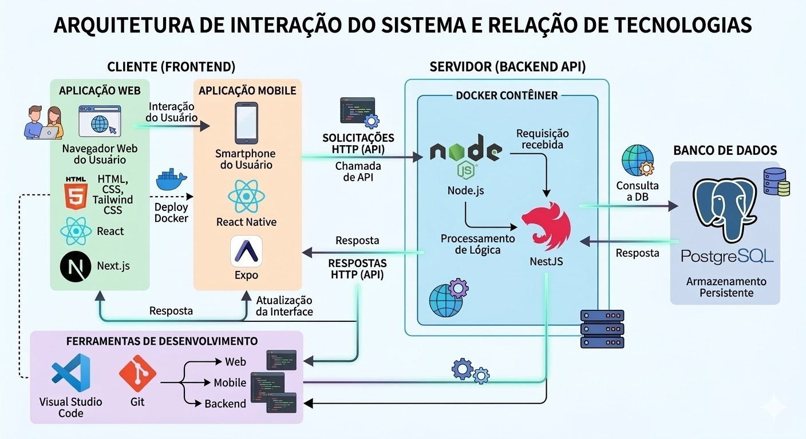

# Introdução

Fundada com o objetivo de atuar no desenvolvimento e produção de equipamentos eletrônicos, a Unitech é uma empresa fictícia que, ao longo do tempo, expandiu suas operações e passou a atender diferentes regiões por meio de unidades produtivas, centros de distribuição e parcerias com fornecedores e clientes. Para garantir o funcionamento eficiente dessas operações, a empresa estruturou uma frota própria de veículos utilizada no transporte de materiais, equipamentos e colaboradores entre suas diversas unidades e pontos logísticos.

Embora a frota não esteja diretamente ligada ao processo de fabricação dos eletrônicos produzidos pela empresa, ela desempenha um papel estratégico no suporte logístico e administrativo da organização. A movimentação de insumos, a distribuição de produtos e o deslocamento de equipes dependem diretamente da disponibilidade e da gestão eficiente desses veículos, tornando a frota um elemento fundamental para a continuidade das operações.

Com o crescimento das atividades da empresa e o aumento da complexidade logística, surgiram desafios relacionados ao controle operacional da frota. Entre esses desafios estão o acompanhamento da utilização dos veículos, o controle de custos operacionais, o planejamento de manutenções preventivas, o rastreamento das rotas realizadas e a obtenção de informações confiáveis que auxiliem na tomada de decisões gerenciais.

No cenário atual, muitas organizações que dependem de frota própria enfrentam dificuldades semelhantes, principalmente quando não possuem sistemas integrados capazes de centralizar e organizar as informações operacionais. A ausência de ferramentas adequadas pode resultar em falhas de comunicação, atrasos logísticos, aumento de custos e riscos operacionais decorrentes da falta de controle e visibilidade sobre os recursos da frota.

Diante desse contexto, este projeto propõe o desenvolvimento de uma aplicação distribuída voltada para a gestão da frota da empresa Unitech. A solução busca estruturar um sistema capaz de integrar informações, apoiar o controle das operações e oferecer maior transparência e confiabilidade aos processos relacionados ao uso dos veículos.

A proposta envolve a análise do contexto organizacional da empresa e a definição de uma arquitetura tecnológica distribuída que permita maior escalabilidade, disponibilidade e eficiência no gerenciamento da frota. Dessa forma, o sistema poderá contribuir para a melhoria do controle operacional e para a tomada de decisões baseadas em dados.

O público-alvo da aplicação inclui principalmente gestores administrativos responsáveis pelo planejamento e controle da frota, bem como os motoristas que utilizam os veículos nas atividades operacionais do dia a dia.

## Problema

Atualmente, o gerenciamento dessa frota ocorre de forma descentralizada, com controles realizados por meio de planilhas, registros manuais e comunicações informais entre setores. Esse modelo gera fragmentação das informações e limita a visibilidade gerencial sobre o uso dos veículos.

Entre os principais problemas identificados no contexto atual, destacam-se:

- Ausência de um sistema centralizado para controle de disponibilidade e alocação dos veículos;
- Dificuldade no planejamento e acompanhamento de rotas para transporte de materiais e colaboradores;
- Controle ineficiente de manutenções preventivas e corretivas, aumentando o risco de indisponibilidade inesperada;
- Baixa rastreabilidade dos custos associados à frota (combustível, manutenção, depreciação, seguros e multas);
- Falta de indicadores consolidados que apoiem decisões estratégicas relacionadas à renovação da frota ou otimização de recursos;
- Comunicação pouco estruturada entre setores solicitantes, gestores de frota e motoristas.

Esse cenário impacta diretamente a eficiência logística da empresa, podendo gerar atrasos no deslocamento de equipes, dificuldades na movimentação de materiais e aumento de custos operacionais indiretos. Ainda que a frota não esteja envolvida na linha de produção dos eletrônicos, sua má gestão compromete o suporte às atividades corporativas e logísticas da organização.

O problema central, portanto, consiste na inexistência de um mecanismo integrado e estruturado que permita controle, monitoramento e análise das informações relacionadas à frota, garantindo maior confiabilidade, transparência e eficiência na gestão desses recursos.

## Objetivos

Objetivo Geral

Desenvolver uma aplicação distribuída para gestão da frota da Unitech, destinada ao controle e monitoramento do transporte de materiais, equipamentos e colaboradores, visando aumentar a eficiência logística e a confiabilidade das informações gerenciais.

Objetivos Específicos

- Modelar uma arquitetura distribuída que permita integração entre diferentes módulos do sistema (cadastro de veículos, controle de utilização, manutenção e relatórios).
- Implementar um mecanismo centralizado de registro e acompanhamento das solicitações de transporte de materiais e colaboradores entre unidades da empresa.
- Desenvolver um módulo de controle de manutenções preventivas e corretivas, permitindo planejamento e redução de indisponibilidades inesperadas.
- Definir e implementar indicadores de desempenho (KPIs) relacionados à utilização, disponibilidade e custos da frota.

## Justificativa

A gestão de frotas corporativas constitui um elemento estratégico para organizações que dependem de deslocamento de recursos físicos e humanos para sustentar suas operações administrativas e logísticas. No contexto da Unitech, empresa do setor de produção de eletrônicos, a frota própria não está diretamente ligada à linha de produção, porém exerce papel fundamental no transporte de materiais, equipamentos e colaboradores entre unidades, fornecedores e centros de distribuição.

A ausência de um sistema estruturado e integrado para gerenciamento desses recursos pode gerar impactos indiretos significativos, como aumento de custos operacionais, falhas de planejamento logístico, indisponibilidade de veículos e dificuldade na consolidação de informações para análise gerencial. Mesmo não interferindo diretamente na fabricação dos produtos, a ineficiência no suporte logístico compromete a organização como um todo.

A escolha deste tema justifica-se tanto pela relevância prática quanto pelo potencial acadêmico. Sob a perspectiva organizacional, a proposta contribui para a melhoria da eficiência, transparência e controle dos recursos da empresa. Sob a perspectiva técnica, o projeto possibilita a aplicação de conceitos fundamentais de sistemas distribuídos, como comunicação entre serviços, sincronização de dados, tolerância a falhas, escalabilidade e segurança.

## Público-Alvo

A aplicação será utilizada por diferentes perfis internos da Unitech, empresa do setor de produção de eletrônicos, cujas atividades envolvem transporte de materiais, equipamentos e colaboradores entre unidades. Os usuários possuem níveis distintos de familiaridade com tecnologia, diferentes responsabilidades organizacionais e variadas necessidades informacionais.

De modo geral, trata-se de um público corporativo, com experiência prévia no uso de sistemas administrativos (ERPs, planilhas eletrônicas, sistemas internos), porém com diferentes níveis de profundidade técnica. Parte dos usuários desempenha funções estratégicas e analíticas, enquanto outros atuam em nível operacional.

### Perfis de Usuários

**Gestores Administrativos**
Profissionais com visão estratégica e responsabilidade pela supervisão da frota. Possuem conhecimento intermediário em ferramentas digitais e utilizam sistemas para apoio à tomada de decisão. Valorizam relatórios consolidados, indicadores de desempenho e informações confiáveis. Exercem posição hierárquica de coordenação ou gerência.

**Equipe de Logística**
Usuários responsáveis pelo planejamento de transporte de materiais e colaboradores. Utilizam o sistema para registrar solicitações, acompanhar disponibilidade de veículos e organizar rotas. Possuem conhecimento intermediário em tecnologia e experiência prática em operações logísticas.

**Motoristas**
Usuários com foco operacional, responsáveis pela execução do transporte. Apresentam diferentes níveis de familiaridade com tecnologia, geralmente restrita ao uso de smartphones e aplicativos básicos. Necessitam de interfaces simples, diretas e de fácil interação.

## Personas

### Persona 1 – Gestor Administrativo

---

### Persona 2 – Analista de Logística

---

### Persona 3 - Motorista

---

## Mapa de Stakeholders

# Especificações do Projeto

## Requisitos

As tabelas que se seguem apresentam os requisitos funcionais e não funcionais que detalham o escopo do projeto. Para determinar a prioridade de requisitos, aplicar uma técnica de priorização de requisitos e detalhar como a técnica foi aplicada.

### Requisitos Funcionais

|ID    | Descrição do Requisito  | Prioridade |
|------|-----------------------------------------|----|
|RF-001| O sistema deve permitir a gestão veículos da frota através de criações, remoções e atualizações   | ALTA |
|RF-002| O sistema deve permitir gerenciar histórico de manutenção e custos relacionados através de criação/atualização de registros de rotinas de manutenções   | MÉDIA |
|RF-003| O sistema deve permitir gerenciar o histórico de consumo de combustível registrando o gasto de cada jornada do motorista   | MÉDIA |
|RF-004| O sistema deve disponibilizar a localização do usuário para rastreamento do veículo   | MÉDIA |
|RF-005| O sistema deve permitir gerenciar contas de motoristas e permissões para uso dos veículos   | MÉDIA |
|RF-006| O sistema deve permitir gerenciar multas e sinistros registrando-as   | MÉDIA |
|RF-007| O sistema deve disponibilizar dashboard para gestão da frota, contendo métricas e KPIs para a análise de dados e tomadas de decisões   | ALTA |
|RF-008| O sistema deve permitir a gestão de pedidos de entregas de eletrônicos   | ALTA |

### Requisitos não Funcionais

|ID     | Descrição do Requisito  |Prioridade |
|-------|-------------------------|----|
|RNF-001| O sistema deve ser responsivo para rodar em um dispositivos móvel e navegadores | ALTA | 
|RNF-002| O sistema deve processar requisições do usuário em no máximo 3s |  MÉDIA | 
|RNF-003| O servidor deve utilizar obrigatoriamente HTTPS |  ALTA | 
|RNF-004| Para dados confidenciais o servidor deve utilizar algorítmos de criptografia |  ALTA |
|RNF-005| Deve-se realizar rotina de backups semanais |  ALTA |
|RNF-006| O sistema deve permitir acesso somente a usuários cadastrados | ALTA |

## Restrições

O projeto está restrito pelos itens apresentados na tabela a seguir.

|ID| Restrição |
|--|-----------|
| 01 | O tempo disponível para desenvolvimento é curto, limitado ao semestre letivo, o que restringe a quantidade de funcionalidades que podem ser implementadas. |
| 02 | Não há orçamento disponível para aquisição de ferramentas, APIs pagas ou infraestrutura adicional, limitando o projeto ao uso de tecnologias gratuitas e open‑source. |
| 03 | A equipe é pequena e possui nível técnico limitado, o que reduz a complexidade possível da solução e impede o uso de tecnologias avançadas ou de difícil implementação. |

# Catálogo de Serviços

### 1. Serviço de Gestão de Veículos

**Descrição:**  
Responsável pelo cadastro, atualização e gerenciamento completo dos veículos que compõem a frota.

**Funcionalidades:**  
- Cadastro de novos veículos.  
- Edição e remoção de registros.  
- Consulta geral da frota com filtros.  
- Controle de status (ativo, em manutenção, reservado, inativo).

**Benefícios:**  
- Padronização dos dados da frota.  
- Facilidade na visualização da disponibilidade dos veículos.  
- Redução de inconsistências cadastrais.

### 2. Serviço de Gestão de Manutenções

**Descrição:**  
Gerencia o ciclo de vida das manutenções preventivas e corretivas da frota, registrando ocorrências e custos.

**Funcionalidades:**  
- Registro de manutenções preventivas e corretivas.  
- Histórico completo de serviços realizados.  
- Notificações para revisões agendadas ou atrasadas.  
- Acompanhamento de custos de manutenção.

**Benefícios:**  
- Redução de falhas inesperadas.  
- Planejamento preventivo da frota.  
- Suporte para tomada de decisão e auditorias.

### 3. Serviço de Controle de Consumo de Combustível

**Descrição:**  
Controla e registra o consumo de combustível para cada viagem realizada.

**Funcionalidades:**  
- Registro de consumo por jornada.  
- Cálculo de gasto por quilômetro.  
- Histórico consolidado por motorista e por veículo.  
- Identificação de padrões de consumo.

**Benefícios:**  
- Visibilidade mais clara dos custos operacionais.  
- Apoio à gestão financeira da frota.  
- Auxílio na identificação de anomalias no consumo.

### 4. Serviço de Rastreabilidade e Localização

**Descrição:**  
Fornece recursos de localização geográfica durante o uso operacional, permitindo rastreamento básico do veículo.

**Funcionalidades:**  
- Captura da localização do usuário durante a rota.  
- Exibição do veículo em mapa.  
- Registro de trajetos (em formato simplificado).  
- Suporte a cenários de baixa conectividade.

**Benefícios:**  
- Maior segurança operacional.  
- Melhor acompanhamento de rotas.  
- Suporte à logística em tempo real.

### 5. Serviço de Gestão de Motoristas e Permissões

**Descrição:**  
Administra informações dos motoristas e suas permissões dentro do sistema.

**Funcionalidades:**  
- Cadastro e edição de motoristas.  
- Associação de motoristas aos veículos.  
- Perfis e níveis de acesso diferenciados.  
- Controle de autenticação.

**Benefícios:**  
- Controle adequado de uso da frota.  
- Melhoria na governança e rastreabilidade.  
- Responsabilização clara por eventos operacionais.

### 6. Serviço de Gestão de Multas e Sinistros

**Descrição:**  
Registra multas e ocorrências envolvendo os veículos da frota.

**Funcionalidades:**  
- Cadastro de multas com detalhes.  
- Registro de sinistros (danos, local, motorista envolvido).  
- Histórico por veículo e motorista.  
- Consulta consolidada por período.

**Benefícios:**  
- Visão clara de riscos e incidentes.  
- Apoio ao compliance e processos internos.  
- Suporte a seguros e auditorias.

### 7. Serviço de Gestão de Solicitações e Entregas

**Descrição:**  
Gerencia pedidos internos de transporte de materiais, equipamentos e eletrônicos entre unidades da Unitech.

**Funcionalidades:**  
- Abertura de solicitações de transporte.  
- Associação de pedidos a motoristas e veículos.  
- Controle do status dos pedidos.  
- Histórico completo das rotas e entregas realizadas.

**Benefícios:**  
- Redução de falhas de comunicação.  
- Centralização das demandas logísticas.  
- Melhor organização e rastreabilidade das entregas.

### 8. Serviço de Dashboard e Indicadores (KPIs)

**Descrição:**  
Oferece visualizações gerenciais e métricas essenciais para monitoramento e tomada de decisão.

**Funcionalidades:**  
- KPIs de utilização da frota.  
- Indicadores de disponibilidade e custos.  
- Métricas de consumo e manutenção.  
- Relatórios e dashboards consolidados.

**Benefícios:**  
- Suporte estratégico para gestores.  
- Maior transparência operacional.  
- Melhoria contínua baseada em dados.

# Arquitetura da Solução

Definição de como o software é estruturado em termos dos componentes que fazem parte da solução e do ambiente de hospedagem da aplicação.

## Tecnologias Utilizadas

### Tecnologias Utilizadas

Para o desenvolvimento da solução proposta serão utilizadas tecnologias voltadas para aplicações web, mobile e backend, organizadas em uma arquitetura cliente-servidor.

**Aplicação Web (Frontend):**

* **HTML** – linguagem de marcação utilizada para estruturar as páginas da aplicação.
* **CSS** – utilizada para estilização e layout da interface.
* **Tailwind CSS** – framework utilitário para construção de interfaces responsivas.
* **React** – biblioteca JavaScript para construção de interfaces baseadas em componentes.
* **Vite** – ferramenta de build e servidor de desenvolvimento para aplicações frontend.
* **Firebase Authentication** - ferramenta de gestão de cadastro, autenticação e autorização de contas via OAuth ou através de email e senha.

**Aplicação Mobile:**

* **React Native** – framework para desenvolvimento de aplicativos móveis multiplataforma utilizando JavaScript.
* **Expo** – plataforma e conjunto de ferramentas que facilita o desenvolvimento, execução e testes de aplicações React Native.
* **Firebase Authentication** - ferramenta de gestão de cadastro, autenticação e autorização de contas via OAuth ou através de email e senha.

**Backend (API):**

* **Node.js** – ambiente de execução JavaScript no servidor.
* **NestJS** – framework para desenvolvimento de APIs estruturadas e escaláveis.

**Banco de Dados:**

* **PostgreSQL** – sistema gerenciador de banco de dados relacional utilizado para armazenamento persistente das informações do sistema.

**Infraestrutura e Contêineres:**

* **Docker** – plataforma utilizada para criação e execução de contêineres, permitindo padronização do ambiente e facilidade de implantação da aplicação.

**Ferramentas de Desenvolvimento:**

* **Visual Studio Code** – ambiente de desenvolvimento utilizado para implementação do sistema.
* **Git** – sistema de controle de versão para gerenciamento do código-fonte.

## Hospedagem

A arquitetura dos componentes a serem utilizados no processo de hospedagem visa otimizar ao máximo os gastos financeiros do projeto, trazendo inúmeros sistemas que, além de serem altamente escaláveis, possuem um plano gratuito relativamente generoso. Segue abaixo a lista dos componentes propostos:
- App Engine: o App Engine é um produto serverless oferecido no GCP que possui a capacidade de hospedar servidores Next.js/React.js de maneira ininterrupta e com um controle refinado de rollout, rollback e versionamento;
- Cloud Run: além do App Engine, o Cloud Run é um serviço oferecido no GCP que visa trazer uma alta customização através da injeção de containers dockers em seus servidores de maneira prática e rápida, permitindo uma configuração avançada para sistemas de backend;
- Firebase Authentication: visando agilizar o processo de desenvolvimento, escolhemos o Firebase Authentication para lidar com o módulo de autenticação e autorização do sistema de maneira otimizada e confiável.
- CockroachDB: ainda utilizando a infraestrutura do GCP, o banco de dados CockroachDB foi escolhido justamente por ser uma solução projetada para ser executada em nuvem e ser um fork do PostgreSQL, trazendo features excelentes e permitindo uma configuração de clusters e backups de maneira rápida e nativa da própria plataforma.
