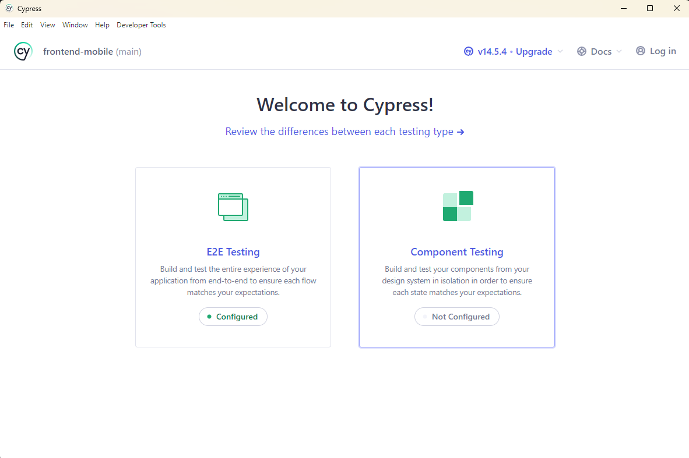
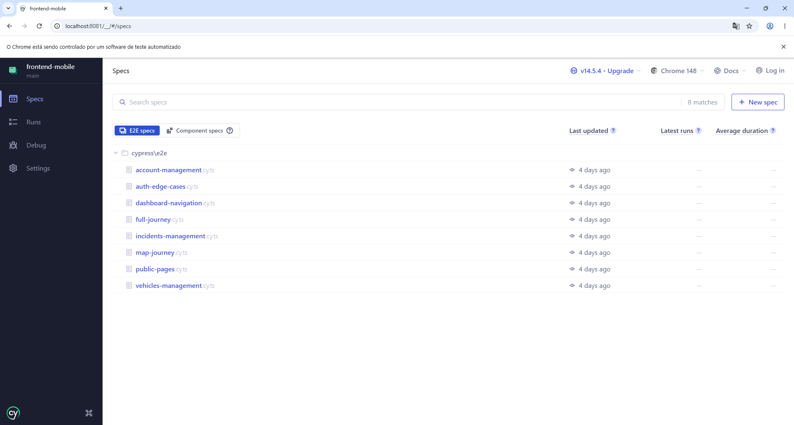
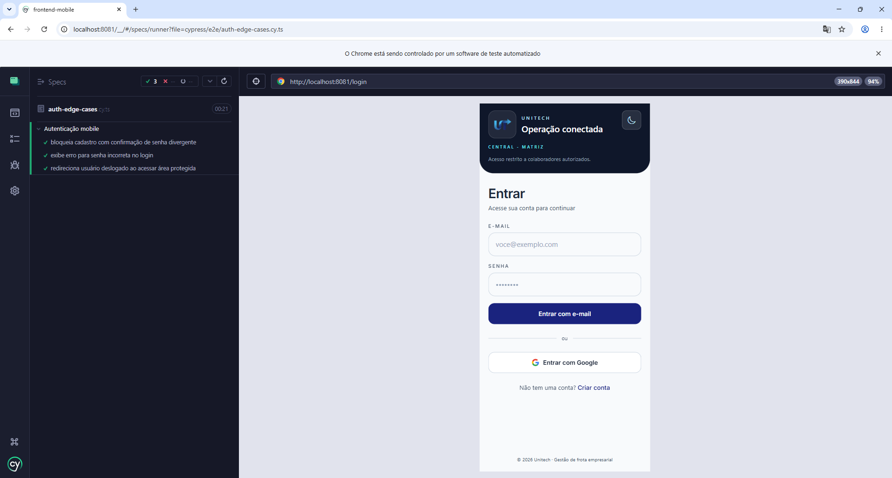
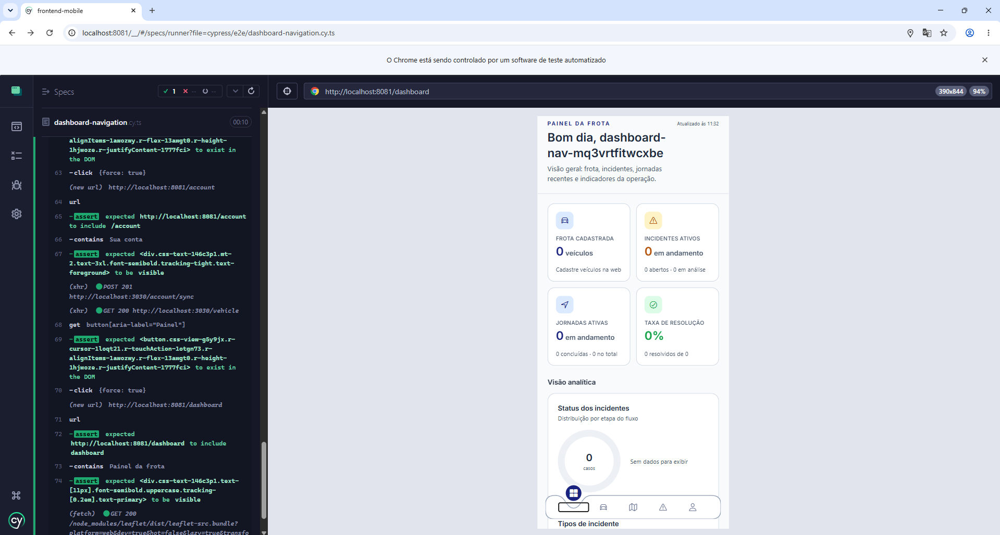
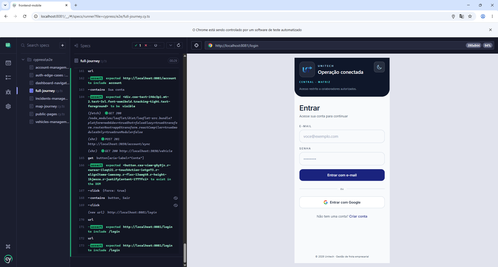
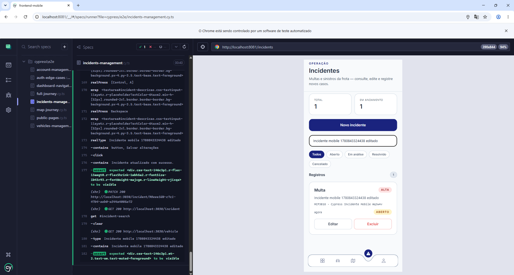
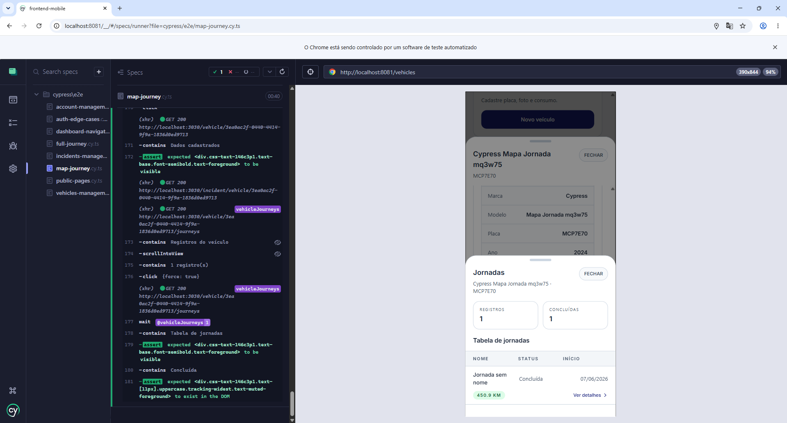
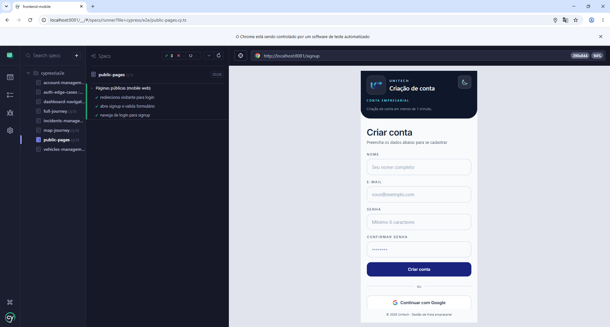
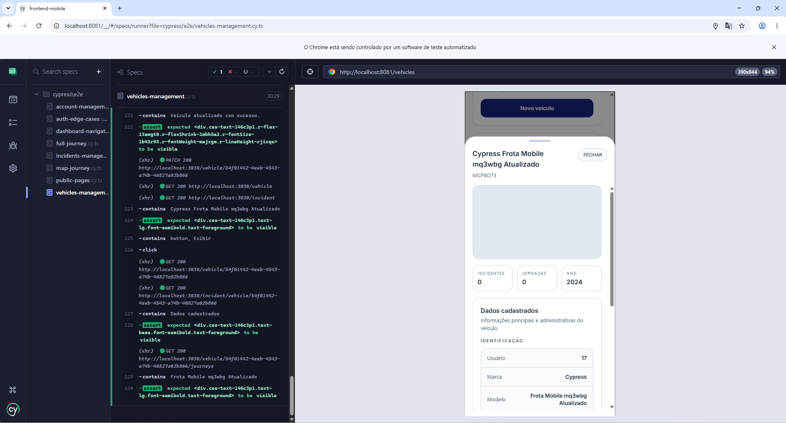

# Front-end Móvel

O aplicativo móvel **Unitech Frota** é a interface nativa da plataforma de gestão de frota da Unitech, voltada principalmente para motoristas e equipes de logística que necessitam acompanhar e executar operações de campo diretamente pelo smartphone. Desenvolvido em **React Native com Expo**, o app oferece as mesmas capacidades essenciais do frontend Web — autenticação, painel de KPIs, controle de veículos, registro de incidentes e execução de jornadas com GPS adaptadas para a experiência mobile com navegação por aba inferior, gestos nativos e integração com hardware do dispositivo (localização, feedback tátil).

O app móvel atua como cliente do mesmo backend da plataforma Web, consumindo os endpoints REST via token Firebase, garantindo controle de acesso centralizado e consistência de dados entre plataformas.

## Projeto da Interface
A interface móvel foi desenvolvida com **Expo Router** (file-based routing), separando:

- **Área pública**: telas de login (`/login`) e cadastro (`/signup`), acessíveis sem autenticação;
- **Área autenticada** (`/(app)`): homepage, dashboard, mapa, veículos, incidentes e conta, protegidas pelo componente `AuthGate`.

Principais decisões de layout e interação:

- Navegação principal por **tab bar inferior fixa** (`AppTabBar`) com ícone + rótulo e destaque visual da aba ativa (fundo `accent`, cor `primary`);
- Organização visual por **cards empilhados** com KPIs em grade de 2 colunas;
- **Pull-to-refresh** em todas as listagens para atualização de dados sem recarregamento manual;
- Suporte nativo a **safe area** e gestos de retorno para navegação fluida em iOS e Android;
- Telas de leitura com estados vazios orientados para próxima ação;
- Feedback tátil via `expo-haptics` em ações críticas.

### Wireframes

Wireframes das principais telas do aplicativo móvel:


### Design Visual

O design visual do app móvel segue a mesma identidade da plataforma Web Unitech, adaptada às convenções nativas:

**Paleta de cores (modo claro — padrão atual):**

| Token | Hex | Uso |
|-------|-----|-----|
| `background` | `#F8FAFC` | Fundo das telas |
| `foreground` | `#1E293B` | Texto principal |
| `card` | `#FFFFFF` | Cards e tab bar |
| `primary` | `#1A237E` | Marca, aba ativa, títulos de destaque |
| `muted-foreground` | `#475569` | Texto secundário e rótulos |
| `accent` | `#DBEAFE` | Fundo de ícones e chips |
| `border` | `#CBD5E1` | Bordas de cards e separadores |
| `ring` | `#38BDF8` | Indicador de foco |
| `destructive` | `#DC2626` | Erros e ações críticas |
| `success` | `#16A34A` | Estados resolvidos / severidade baixa |
| `warning` | `#CA8A04` | Atenção / incidentes em aberto |

O modo escuro (background `#0F172A`, primary `#38BDF8`, surface `#1E293B`) está planejado e segue os mesmos tokens do tema escuro do Web.

**Tipografia:**

| Elemento | Estilo |
|----------|--------|
| Eyebrow de módulo | 11 px, semibold, uppercase, espaçamento 0,2 em |
| Título de tela | 24–28 px, semibold |
| Corpo e listas | 14 px, regular |
| Valor de KPI | 24 px, semibold, cor por categoria |
| Rótulo da tab bar | 10 px, medium |

Fonte principal: **Inter** (`@expo-google-fonts/inter`), equivalente mobile ao Geist Sans utilizado no Web.

**Iconografia:** biblioteca `@expo/vector-icons` (Ionicons) para ações e estados de interface.

**Componentização:** base de componentes reutilizáveis em `src/components/` (`AppScreen`, `AppTabBar`, `ModuleHeader`, `KpiCard`, `ShortcutCard`, `Card`, `Badge`, `Button`, `Input`, `SearchInput`, `Chip`) estilizados com **NativeWind** (Tailwind CSS para React Native).

**Padrões de UI observados:**

- Cabeçalho de módulo com eyebrow, título e descrição (`ModuleHeader`);
- Faixa de KPIs em grade 2 colunas (`KpiCard`);
- Listagens com `FlatList`, busca e pull-to-refresh;
- Badges semânticos de severidade/status alinhados ao Web;
- Cards com `rounded-xl`, borda e sombra leve;
- Rótulos e placeholders em português.

**Navegação (tab bar):**

| Aba | Rota | Ícone |
|-----|------|-------|
| Início | `/(app)/homepage` | home |
| Painel | `/(app)/dashboard` | grid |
| Mapa | `/(app)/map` | map |
| Frota | `/(app)/vehicles` | car |
| Incidentes | `/(app)/incidents` | warning |
| Conta | `/(app)/account` | person |

## Fluxo de Dados

O app móvel segue o mesmo fluxo de autenticação e consumo de API do frontend Web:

1. Usuário acessa as telas públicas (`/login` ou `/signup`);
2. Na autenticação (e-mail/senha ou Google via `expo-auth-session`), o Firebase retorna a sessão e o **ID Token**;
3. O app persiste o token de forma segura no dispositivo via `expo-secure-store` e chama o endpoint de sincronização de conta (`POST /account/sync`) no backend;
4. O componente `AuthGate` verifica o estado de autenticação e redireciona para `/(app)/homepage` ou para `/login` conforme necessário;
5. Em toda a área autenticada, as requisições ao backend são enviadas via **axios** com o cabeçalho `Authorization: Bearer <token>`, obtido em tempo real pelo `getIdToken()` do Firebase;
6. O token é renovado automaticamente pelo listener `onIdTokenChanged` do Firebase SDK;
7. No módulo de mapa (`/(app)/map`), o app captura a localização do dispositivo via `expo-location` e registra posições na API (`POST /journey/:id/positions`) durante jornadas ativas;
8. No logout, a sessão é encerrada no Firebase e o token armazenado localmente é removido do `expo-secure-store`.

Resumo de integrações:

- **Autenticação**: Firebase Authentication (SDK `firebase` v12 + `expo-auth-session` para OAuth Google);
- **Armazenamento seguro local**: `expo-secure-store` (token e dados de sessão);
- **API de negócio**: backend da aplicação via `axios` (veículos, incidentes, membros, conta, jornadas, telemetria, analytics);
- **Geolocalização**: `expo-location` + `react-native-maps` (nativo iOS/Android).

## Tecnologias Utilizadas

- **Framework Mobile**: React Native 0.81.5;
- **Plataforma de desenvolvimento**: Expo ~54 (nova arquitetura habilitada — `newArchEnabled: true`);
- **Roteamento**: Expo Router ~6 (file-based routing, rotas tipadas);
- **Linguagem**: TypeScript 5.9;
- **Estilo/UI**: NativeWind 4 (Tailwind CSS para React Native), componentes customizados em `src/components/`;
- **Autenticação**: Firebase Authentication (SDK v12) + `expo-auth-session` (Google OAuth);
- **Armazenamento seguro**: `expo-secure-store`;
- **HTTP/API**: `axios` 1.16;
- **Mapas e localização**: `react-native-maps` 1.20 + `expo-location` ~19;
- **Fontes**: `@expo-google-fonts/inter` + `expo-font`;
- **Navegação**: `@react-navigation/native` + `@react-navigation/bottom-tabs`;
- **Animações**: `react-native-reanimated` ~4 + `react-native-gesture-handler`;
- **Feedback tátil**: `expo-haptics`;
- **Testes E2E**: Cypress 14 + `cypress-real-events`;
- **Qualidade de código**: ESLint (eslint-config-expo), Prettier (prettier-plugin-tailwindcss);
- **Build e distribuição**: Expo EAS Build.

## Considerações de Segurança

Medidas aplicadas no app móvel:

- **Token Firebase armazenado com segurança**: uso de `expo-secure-store` em vez de `AsyncStorage` comum para persitir credenciais, evitando exposição em armazenamento não cifrado do dispositivo;
- **Autenticação centralizada**: Firebase Auth com renovação automática do ID Token via `onIdTokenChanged`, garantindo que requisições nunca utilizem tokens expirados;
- **Transporte seguro**: todas as chamadas ao backend trafegam via HTTPS; o backend exige `AuthGuard` global com validação de Bearer token e revogação (`checkRevoked: true`);
- **Controle de acesso por papel**: o backend aplica verificação de papéis (`owner`, `admin`, `user`) nos endpoints sensíveis; o app respeita essas restrições ao exibir ou ocultar ações na interface;
- **Proteção de rota local**: o componente `AuthGate` impede acesso à área autenticada sem sessão válida, redirecionando para `/login`;
- **Permissões de plataforma declaradas explicitamente**: `ACCESS_FINE_LOCATION` / `ACCESS_COARSE_LOCATION` (Android) e `NSLocationWhenInUseUsageDescription` (iOS) declarados no `app.json`, com coleta de localização apenas durante uso ativo;
- **Modo de desenvolvimento isolado**: suporte a variável `EXPO_PUBLIC_SKIP_FIREBASE_AUTH=1` para desenvolvimento local sem credenciais reais, evitando exposição de configurações de produção.

Recomendações para produção:

- Garantir que as chaves `EXPO_PUBLIC_FIREBASE_*` e `EXPO_PUBLIC_GOOGLE_MAPS_API_KEY` estejam configuradas como variáveis de ambiente no EAS Build, sem versionamento em repositório;
- Habilitar Certificate Pinning via configuração de rede nativa para mitigar ataques de MITM;
- Revisar e minimizar as permissões solicitadas ao sistema operacional de acordo com as funcionalidades efetivamente utilizadas;
- Configurar regras de expiração de sessão alinhadas ao backend para evitar tokens de longa duração;
- Ativar monitoramento de crashes (ex.: Sentry com `@sentry/react-native`) em produção para rastreamento de falhas sem expor dados sensíveis do usuário.


## Implantação

Implantação sugerida para o app móvel com **Expo EAS Build**:

1. **Requisitos de ambiente**: Node.js LTS, `npm` ou equivalente, Expo CLI (`npx expo`) e conta na plataforma Expo (para EAS Build). Para builds locais, Xcode (iOS) ou Android SDK (Android) são necessários.

2. **Configuração das variáveis de ambiente**: criar o arquivo `.env` na raiz de `src/frontend-mobile/` com as chaves necessárias:
   ```
   EXPO_PUBLIC_API_URL=https://<url-do-backend>
   EXPO_PUBLIC_FIREBASE_API_KEY=...
   EXPO_PUBLIC_FIREBASE_AUTH_DOMAIN=...
   EXPO_PUBLIC_FIREBASE_PROJECT_ID=...
   EXPO_PUBLIC_FIREBASE_APP_ID=...
   EXPO_PUBLIC_GOOGLE_WEB_CLIENT_ID=...
   ```
   Em produção via EAS Build, as variáveis devem ser configuradas no painel do Expo ou no arquivo `eas.json` (`env` por perfil).

3. **Instalação de dependências**:
   ```bash
   cd src/frontend-mobile
   npm install
   ```

4. **Execução em desenvolvimento**:
   ```bash
   npx expo start          # inicia o servidor Metro
   npx expo start --android  # abre no emulador Android
   npx expo start --ios      # abre no simulador iOS
   ```

5. **Build para produção com EAS**:
   ```bash
   npm install -g eas-cli
   eas build --platform android --profile production
   eas build --platform ios --profile production
   ```

6. **Publicação nas lojas**:
   - **Google Play Store**: submeter o artefato `.aab` gerado pelo EAS Build pela Google Play Console;
   - **Apple App Store**: submeter o artefato `.ipa` gerado via EAS Build pela App Store Connect;
   - Alternativamente, usar `eas submit` para automatizar o envio às lojas a partir do EAS.

7. **Validação pós-deploy**: verificar login/cadastro, navegação protegida, listagem de veículos/incidentes, execução de jornada com GPS e logout em dispositivo físico ou emulador conectado ao ambiente de produção.

## Testes

A estratégia atual prioriza **testes end-to-end (E2E)** para validar jornadas reais do usuário no app móvel, espelhando a abordagem adotada no frontend Web. Os cenários exercitam autenticação, navegação por abas, formulários em bottom sheets, integração com a API NestJS e o fluxo completo de jornada no mapa.

### Escopo e ambiente de execução

Os testes rodam contra o **Expo Web** (`http://localhost:8081`), e não em emulador Android/iOS. Essa escolha permite reutilizar o Cypress e validar a mesma lógica de negócio (hooks, gateways HTTP, autenticação Firebase) com viewport mobile (390×844 px), simulando a experiência em smartphone no navegador.

**Pré-requisitos para execução local:**

1. Backend NestJS em execução (`src/backend`, porta padrão `3030`);
2. Variáveis de ambiente do mobile preenchidas em `src/frontend-mobile/.env` (mesmo projeto Firebase do web);
3. Expo Web servindo o app (`npm run web` em `src/frontend-mobile`).

**Comandos:**

```bash
cd src/frontend-mobile

# Terminal 1 — backend
cd ../backend && pnpm run start:dev

# Terminal 2 — app mobile web
npm run web

# Terminal 3 — Cypress
npm run cy:open   # modo interativo
npm run cy:run    # headless (CI/local)
```

Porta alternativa do Expo: `CYPRESS_BASE_URL=http://localhost:19006 npm run cy:run`.

### Ferramentas adotadas

| Ferramenta | Uso |
|------------|-----|
| **Cypress 14** | Orquestração dos testes E2E, interceptação de rede e asserções |
| **cypress-real-events** | Digitação e clique em inputs do React Native Web (campos que aparecem como `disabled` para o Cypress nativo) |
| **Helpers em `cypress/support/app-helpers.ts`** | Fluxos reutilizáveis: cadastro, login, navegação por tab bar, CRUD de veículo/incidente e jornada no mapa |

Configuração em `cypress.config.mjs` (viewport mobile, `baseUrl`, spec pattern). A pasta `cypress/` possui `tsconfig.json` próprio e está excluída do `tsc` do Expo.

### Casos de teste E2E (resumo)

Suíte em `src/frontend-mobile/cypress/e2e/`:

| Arquivo | Cobertura |
|---------|-----------|
| `public-pages.cy.ts` | Acesso a login/signup e validação básica dos formulários públicos |
| `auth-edge-cases.cy.ts` | Senha divergente no cadastro, senha incorreta no login e redirecionamento de rota protegida |
| `dashboard-navigation.cy.ts` | Cadastro, navegação pelas abas (Painel, Frota, Mapa, Incidentes, Conta) e elementos do painel |
| `vehicles-management.cy.ts` | Cadastro de veículo, edição pelo card da frota e abertura do detalhe (**Exibir**) |
| `incidents-management.cy.ts` | Criação de incidente vinculado a veículo e edição de descrição |
| `account-management.cy.ts` | Atualização de nome na conta e logout pela aba **Conta** |
| `map-journey.cy.ts` | Jornada completa no mapa: paradas, início, simulação, conclusão na API e validação no histórico do veículo |
| `full-journey.cy.ts` | Smoke test autenticado: conta, frota, incidente, mapa, conta e logout |

### Cobertura funcional por módulo

- **Páginas públicas**: login, signup e transição para área autenticada (`/dashboard` após cadastro).
- **Painel / navegação**: tab bar inferior, KPIs e seção de jornadas recentes.
- **Frota**: cadastro e edição via bottom sheet; detalhe do veículo com incidentes e jornadas.
- **Incidentes**: registro em sheet, vínculo com veículo e edição.
- **Conta**: atualização de perfil e encerramento de sessão.
- **Mapa / jornadas**: seleção de veículo, marcação de paradas (GPS + clique no Leaflet), início da jornada, simulação automática de rota, finalização via API e status **Concluída** no histórico.

### Adaptações mobile em relação ao web

Os testes do web (`src/frontend/cypress/`) serviram de referência, com ajustes para a UI mobile:

- **Navegação**: tab bar (`aria-label`: Painel, Frota, Mapa, Incidentes, Conta) em vez de sidebar;
- **Pós-login**: redirecionamento para `/dashboard` (não `/homepage`);
- **Formulários**: bottom sheets (`AnimatedBottomSheetShell`, `BottomSheetModal`) em veículos, incidentes e painel de jornada no mapa;
- **Mapa**: FAB **Abrir painel de jornada**, paradas via **Minha posição** e cliques no `.leaflet-container` (Leaflet na web);
- **Geolocalização**: mock de `navigator.geolocation` via helper `stubGeolocation()` antes de abrir o mapa;
- **Seletores**: `nativeID` nos campos (`#login-email`, `#vehicle-marca`, `#incident-descricao`, etc.) e `accessibilityRole="button"` em ações críticas;
- **Inputs RN Web**: `cypress-real-events` (`realClick`, `realType`) para campos não editáveis pelo `.type()` padrão.

### Helpers principais (`app-helpers.ts`)

| Helper | Função |
|--------|--------|
| `signUpViaUi` / `loginViaUi` | Autenticação pela interface |
| `goToTab` / `goToModule` | Navegação pela tab bar |
| `createVehicleViaUi` / `createIncidentViaUi` | Cadastros via bottom sheet |
| `stubGeolocation` | Simula GPS no Expo Web |
| `addMapStops` | Adiciona paradas no mapa (GPS + clique) |
| `startMapJourney` / `waitForMapJourneyCompletion` | Inicia e aguarda fim da simulação |
| `assertVehicleHasCompletedJourney` | Valida jornada **Concluída** no histórico do veículo |

### Observações de execução

- Cada spec limpa `localStorage`, `sessionStorage` e `indexedDB` entre testes (`cypress/support/e2e.ts`), isolando sessões Firebase.
- Animações CSS/transitions são desabilitadas durante os testes para reduzir flakiness.
- O cenário de jornada intercepta o OSRM com fallback (`503`) para encurtar a simulação (~40 s) em vez de aguardar rotas longas da API pública.
- A validação pós-jornada consulta o histórico em **Frota → Exibir → Jornadas**, pois o painel não recarrega automaticamente ao trocar de aba.
- Testes unitários e de integração isolados ainda não fazem parte da suíte; a cobertura atual concentra-se em E2E.
- Artefatos Cypress (`cypress/screenshots/`, `cypress/videos/`) estão no `.gitignore` do projeto mobile.

### Estrutura de arquivos de teste

```
src/frontend-mobile/
  cypress.config.mjs
  cypress/
    e2e/              # Specs (*.cy.ts)
    support/
      e2e.ts          # Hooks globais e limpeza de storage
      app-helpers.ts  # Helpers de fluxo mobile
    tsconfig.json
```

### Evidências de teste













# Referências

- React Native Documentation: https://reactnative.dev/docs/getting-started
- Expo Documentation: https://docs.expo.dev
- Expo Router Documentation: https://docs.expo.dev/router/introduction
- NativeWind Documentation: https://www.nativewind.dev/docs/overview
- Firebase Authentication Documentation: https://firebase.google.com/docs/auth
- Cypress Documentation: https://docs.cypress.io
- TypeScript Documentation: https://www.typescriptlang.org/docs

