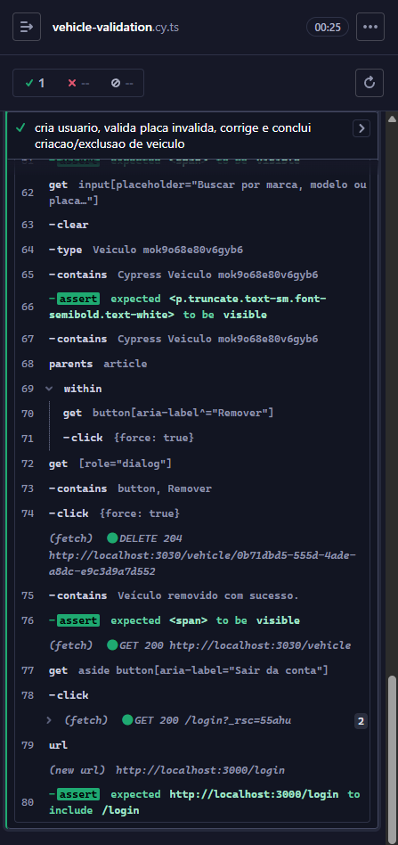
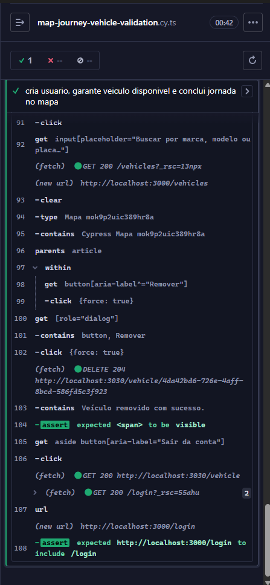
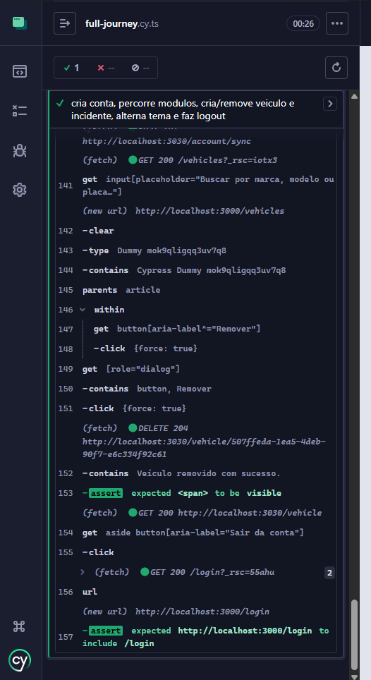

# Front-end Web

A interface Web da plataforma **Unitech** tem como objetivo centralizar a gestão de frotas em uma experiência única para usuários autenticados, cobrindo cadastro e consulta de veículos, controle de incidentes, visualização de indicadores operacionais, gestão de membros e planejamento de jornadas em mapa.

No contexto da aplicação distribuída, o frontend atua como cliente principal do backend via APIs HTTP autenticadas por token (Firebase ID Token), priorizando produtividade operacional, boa usabilidade e feedback visual para ações críticas.

## Projeto da Interface Web

A interface foi desenvolvida em arquitetura baseada em rotas com **Next.js (App Router)**, separando:

- **Área pública**: landing page (`/`), login (`/login`) e cadastro (`/signup`);
- **Área autenticada**: homepage, dashboard, mapa, veículos, incidentes, membros e conta (envolvidas por shell com sidebar).

Principais decisões de layout e interação:

- Navegação principal por **sidebar fixa** com destaque da rota ativa;
- Suporte a **tema claro/escuro** com persistência em `localStorage`;
- Organização visual por cartões, indicadores e blocos funcionais (KPI, listas, formulários, painéis);
- Telas de CRUD com feedbacks imediatos de sucesso/erro;
- Proteção de área logada por verificação de sessão no cliente e pré-carregamento de dados por rotas server-side quando aplicável.

### Wireframes

As imagens das telas foram inseridas na ordem do fluxo de navegação da aplicação:

### Design Visual

O design visual segue estilo moderno com foco operacional:

- **Paleta**:
  - **Tema claro**: fundo `#F8FAFC`, texto `#1E293B`, primária `#1A237E`, acento `#DBEAFE`, borda `#CBD5E1`, ring `#38BDF8`;
  - **Tema escuro**: fundo `#0F172A`, texto `#F1F5F9`, card `#1E293B`, primária `#38BDF8`, secundária/acento `#334155`, ring `#38BDF8`;
  - **Landing page (presets configuráveis)**: roxo (base `#120B21`; linhas `#E945F5`, `#C084FC`, `#F1F5F9`), azul (base `#081429`; linhas `#38BDF8`, `#60A5FA`, `#E2E8F0`), esmeralda (base `#072019`; linhas `#34D399`, `#2DD4BF`, `#E2E8F0`) e âmbar (base `#211305`; linhas `#F59E0B`, `#FB923C`, `#FEF3C7`);
- **Tipografia (fontes exatas)**: `Geist Sans` (via `next/font/google`, variável `--font-geist-sans`) como fonte principal da interface; `Geist Mono` (via `next/font/google`, variável `--font-geist-mono`) para conteúdos monoespaçados; `Frizon` (via `next/font/local`, arquivo `src/frontend/fonts/frizon.ttf`) para destaque no título da landing;
- **Iconografia**: biblioteca `lucide-react` para ações e estados de interface;
- **Componentização**: base de componentes reutilizáveis com `shadcn/ui` + Tailwind;
- **Elementos gráficos**: uso de gradientes, vidro fosco (backdrop blur), sombras suaves e microinterações com animação para melhorar percepção de estado.

Diretrizes de UX observadas:

- Feedback claro para operações (toasts, mensagens de erro, confirmação visual);
- Rótulos e placeholders em português;
- Prioridade para legibilidade dos dados de operação (placa, status, severidade, métricas);
- Estados vazios orientados para próxima ação (ex.: convidar para cadastrar primeiro veículo).

## Fluxo de Dados

Fluxo principal da aplicação Web:

1. Usuário acessa páginas públicas (`/`, `/login`, `/signup`);
2. Na autenticação (email/senha ou Google), o Firebase retorna sessão e ID Token;
3. O frontend sincroniza o token em cookie (`fleet_id_token`) e chama endpoint de sincronização de conta no backend;
4. Em área autenticada, a UI envia requisições ao backend em `NEXT_PUBLIC_API_URL` com header `Authorization: Bearer <token>`;
5. Algumas páginas carregam dados iniciais no servidor (`serverFetchJson`) usando o cookie da sessão para SSR/hidratação inicial;
6. Componentes cliente atualizam dados por `fetch`/gateway conforme ações do usuário (CRUD, filtros, atualização de status);
7. No módulo de mapa, o frontend também consome serviços de rota/tiles (LocationIQ e OSRM) para planejamento e simulação de jornada;
8. No logout, sessão é encerrada no Firebase e cookie de autenticação é removido.

Resumo de integrações:

- **Autenticação**: Firebase Auth;
- **API de negócio**: backend da aplicação (veículos, incidentes, membros, conta, jornadas);
- **Mapas/rotas**: LocationIQ + OSRM (com fallback quando indisponível).

## Tecnologias Utilizadas

- **Framework Web**: Next.js 16 (React 19, App Router);
- **Linguagem**: TypeScript (com alguns componentes em JSX);
- **Estilo/UI**: Tailwind CSS 4, `shadcn/ui`, Radix UI, `lucide-react`;
- **Autenticação**: Firebase Authentication;
- **HTTP/API**: `fetch` e `axios` via adapter;
- **Mapa**: Leaflet + LocationIQ + OSRM;
- **Qualidade de código**: ESLint, Prettier, lint-staged;
- **Testes E2E**: Cypress.

## Considerações de Segurança

Medidas aplicadas no frontend:

- Autenticação centralizada em Firebase com renovação/escuta de token (`onIdTokenChanged`);
- Encaminhamento do token no header `Authorization` para acesso aos endpoints protegidos;
- Persistência de sessão em cookie com `SameSite=Lax` para apoiar leitura server-side;
- Redirecionamento para `/login` quando usuário não autenticado tenta acessar área privada;
- Sanitização básica de fluxo por validações de formulário e controle de estados de erro.

Recomendações para produção:

- Definir expiração/rotação de sessão alinhada ao backend;
- Reforçar políticas de segurança HTTP (CSP, `X-Frame-Options`, `Referrer-Policy`);
- Garantir HTTPS em todo o tráfego e armazenamento seguro das variáveis de ambiente;
- Evitar exposição desnecessária de dados sensíveis na interface (especialmente tokens em tela);
- Revisar regras de autorização por papel no backend para cada recurso exibido no frontend.

## Implantação

Implantação sugerida para o frontend Web:

1. Defina os requisitos de hardware e software necessários para implantar a aplicação em um ambiente de produção.
   - Node.js LTS, gerenciador de pacotes (preferencialmente `pnpm`) e acesso às variáveis públicas necessárias.
2. Escolha uma plataforma de hospedagem adequada, como um provedor de nuvem ou um servidor dedicado.
   - Recomendado: Vercel para fluxo nativo com Next.js (ou alternativa com suporte a Node/SSR).
3. Configure o ambiente de implantação, incluindo a instalação de dependências e configuração de variáveis de ambiente.
   - Variáveis mínimas: `NEXT_PUBLIC_API_URL`, chaves `NEXT_PUBLIC_FIREBASE_*`, `NEXT_PUBLIC_LOCATIONIQ_ACCESS_TOKEN`.
4. Faça o deploy da aplicação no ambiente escolhido, seguindo as instruções específicas da plataforma de hospedagem.
   - Passos típicos: instalar dependências, executar build (`pnpm build`) e publicar artefato (`pnpm start` ou deploy gerenciado).
5. Realize testes para garantir que a aplicação esteja funcionando corretamente no ambiente de produção.
   - Validar login/cadastro, navegação protegida, CRUD de veículos/incidentes, mapa/jornada e logout.

## Testes

A estratégia atual prioriza **testes end-to-end (E2E)** para validar jornadas reais do usuário:

- Navegação em páginas públicas;
- Fluxo completo de criação de conta e login;
- Navegação entre módulos protegidos;
- CRUD de veículos e incidentes;
- Jornada de mapa com validação de disponibilidade de veículo e simulação;
- Alternância de tema e logout.

Ferramenta adotada:

- **Cypress** (`pnpm cy:open` e `pnpm cy:run`).

Casos de teste E2E abordados (resumo):

- **`public-pages.cy.ts`**: valida acesso às páginas públicas e transição da landing para login/cadastro;
- **`full-journey.cy.ts`**: executa jornada completa do usuário (cadastro, login, navegação entre módulos, criação/remoção de veículo e incidente, troca de tema e logout);
- **`vehicle-validation.cy.ts`**: verifica validação de placa inválida e fluxo de correção até criação/exclusão bem-sucedida de veículo;
- **`map-journey-vehicle-validation.cy.ts`**: valida planejamento/início de jornada no mapa, incluindo garantia de veículo disponível e conclusão do fluxo.

### Evidências dos testes (Cypress)

# Referências

- Next.js Documentation: https://nextjs.org/docs
- React Documentation: https://react.dev
- Tailwind CSS Documentation: https://tailwindcss.com/docs
- shadcn/ui Documentation: https://ui.shadcn.com
- Firebase Authentication Documentation: https://firebase.google.com/docs/auth
- Cypress Documentation: https://docs.cypress.io
- Leaflet Documentation: https://leafletjs.com
- LocationIQ API Documentation: https://locationiq.com/docs
- OSRM Project: https://project-osrm.org
